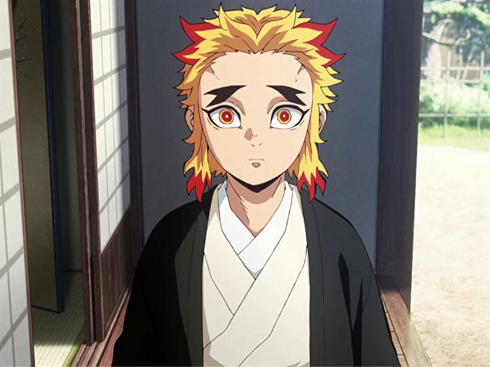

# Senjuro

Visualize growth for kids

**Senjuro** is the complement for **Rengoku** project. With **Senjuro** we can enter children data and being able to monitor growth for them.



**Senjuro** is **Kiojuro Rengoku**'s brother.

## Local development

### Setup

#### 1. Set environment variables

Create a `.env.local` file in the root of the project. Copy all content from `env.example` into `.env.local`. No more changes should be needed

**Note:** You can modify what you consider is necessary.

#### 2. Run project

From withing the container, run:

```sh
npm run serve
```
